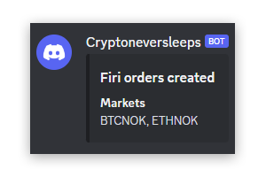

# cryptoneversleeps

> DCA crypto bot that only buys on weekends

It buys crypto of your desire using the [Firi API](https://developers.firi.com) and notifies on Discord when buys are made.

<div align="center">
	
</div>

## Install

### Build the docker image

```bash
docker build -t cryptoneversleeps .
```

### Schedule the cronjob

```bash
crontab -e
```

Add the following line to the crontab:

```sh
37 13 * * 0,6 docker run --rm cryptoneversleeps
```

## Environment variables

See [.env.example](.env.example) for the required environment variables.

## Config file

See [buy-config.json.example](buy-config.json.example) for an example config file.
